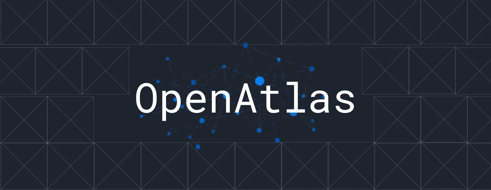
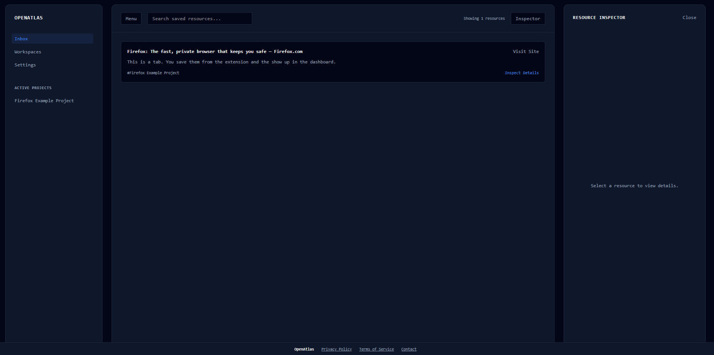
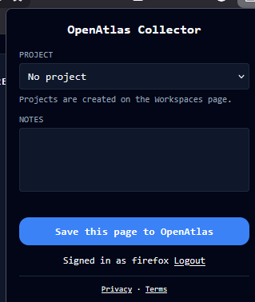

# OpenAtlas
The best solution for keeping your resources organized in projects, research, and more. 
See the live project [here](openatlas.jackjacobson2011.com)
Download the extension below:



## Overview

OpenAtlas is made up of two main parts: a web-based dashboard, and a browser extension. You download the extension and connect it your OpenAtlas account. Using the extension, you can save browser tabs with an optional title, description, and project to the web-based dashboard with the built-in UI. 
You can then manage those resources, access them, manage and update your projects, and more at the webui.

## Tech Stack

### Backend
- Node.js with:
  - Express v4.19.2
  - SQLite3 v6.0.1
    - Used with two database files, one with user info, one with resource info
  - bcrypt v5.1.1 
    - Hashes passwords
  - jsonwebtoken v9.03
    - Manages cookies to keep you logged in
  - cookie-parser v.1.4.7
    - Assists with cookie managment
  - cors v2.8.5

### API
- RESTful JSON API
- Uses express
- Uses JWT-based authentication
  - httpOnly cookies for web client, Bearer tokens for extension

### Frontend
- React v18.3.1
- Vite v.5.3.1
  - Used to build and for a dev server
- vitejs react plugin v4.3.1
- Plain csss
  


### Browser Extension
- Manifest V3
- Vanilla JS


### Infastructure
- [HackClub Nest](nest.hackclub.com)
- PM2
  - Manages backend and keeps alive on server
- nginx
  - Manages revers proxy and static file serving
- Cloudflare 
  - Manges DNS and a tunnel for exposing the server
  
## Project Structure

Below is a tree graph of the file structure with notes on some files and for what each folder should be used for. See the full fire structure in this repo.
```
.
├── backend/
│   ├── config/
│   │   └── [FILES TO GENERATE DATABASE]
│   ├── db/
│   │   └── [BOTH ACTUAL DATABASE FILES AND .SQL FILES FOR INFO ABOUT DATABASES]
│   ├── node_modules/
│   │   └── [AUTO GENERATED CACHE FILES FROM NODE]
│   ├── .env [SHOULD INCLUDE TOKEN YOU GENERATED, PORT]
│   ├── package-lock.json [AUTO GENERATED BY NPM]
│   ├── package.json [INCLUDES PACKAGES FOR NODE]
│   └── server.js [MAIN SERVER RUNNING API]
├── extension/
│   ├── images/
│   │   └── [ICONS IN DIFFERENT SIZES FOR EXTENSION]
│   └── background.js [ENSURES YOU ARE LOGGED IN AND YOU HAVE A VALID TOKEN]
└── frontend/
    └── node_modules/
        ├── [AUTO GENERATED CACHE FILES FROM NODE]
        ├── public/
        │   └── [ICONS FOR THE SITE]
        ├── src/
        │   └── assets/
        │       ├── readme-assets/
        │       │   └── [IMAGES FOR THIS README]
        │       ├── index.css [ALL STYLING FOR THE SITE]
        │       ├── components/
        │       │   └── [ALL PARTS OF THE DASHBOARD AND THE SITE]
        │       ├── context/
        │       │   └── AuthContext.jsx [ENSURES YOU ARE LOGGED IN WITH VALID TOKEN]
        │       └── views/
        │           └── [ALL PAGES OF THE SITE]
        ├── index.html [MAIN FILE LINKING TO DISPLAY main.jsx]
        ├── App.jsx [CALLS ALL REACT FILES TO DISPLAY SITE]
        ├── main.jsx [SETS UP SITE AND CALLS APP.JSX]
        ├── package-lock.json [AUTO GENERATED BY NPM]
        ├── package.json [INCLUDES PACKAGES FOR NODE]
        ├── vite.config.js [CONFIGS VITE DEV SERVER]
        ├── .gitignore [ENSURE YOU INCLUDE NODE MODULES FOLDERS AND .ENV]
        └── extension.crx [CHROME PACKED EXTENSION]
```

## API

I have developed a custom RESTful JSON API. See the endpoints below:
| Type | End Point Location | What It Does | Body | OnSuccess | Returns |
| ---- | ------------------ | ------------ | ---- | --------- | ------- |
Authentication Endpoint | POST /api/auth/register | Creates a new user account. Validates the username (3-32 chars, aplhanumeric + underscores and hyphens) and password (8+ chars), hashes password with bcrypt (12 salt rounds), and inserts the user into the users database. | { username, password, email (optional) } | Issues a signed 7-day expiry JWT with user's ID and username, sets it as an httpOnly cookie (secure in production, sameSite lax), and returns the token in the body so the browser can store it. | { success true, user: {id, username, email, created_at}, token} with status 201
Authentication Endpoint | POST /api/auth/login | Authenticates existing user by looking up username and comparing submitted password against hash | { username, password } | Same cookie behaviour as register, signs new JWT and sets as httpOnly cookie | { success: true, user {...}, token } or returns 400 with { success: false, message: 'Username and password required.' } if either field is missing
Authentication Endpoint | GET /api/auth/status | Checks whether current request carries valid session token, restores session without forcing fresh login. Reads JWT from cookie and verifies against secret, then looks up corresponding user | N/A | If valid and user exists, returns users info. If token is missing, responds with success: ture but authenticated: false | { success: true, authenticated: true, user: { ... } } or { success: trye, authenticated: false }
Authentication Endpoint | POST /api/auth/logout | Clears the httpOnly cookie, ending the session | N/A | Cookie is cleared with matching httpOnly/sameSite/secure options from when it was set | {success: trye, message: 'Session terminated' }
Session/User Endpoint | GET /api/me | Returns currently authenticated user's ID and username, using requireAuth to decode token and populate user.id and username | N/A | Succeeds if requireAuth passes (i.e., a token was present) | { success: true, userId, username }
Project Endpoint | POST /api/projects | Creates new project belonging to the authenticated user, validates that name isnt empty, generates a UUID, inserts the row, then re-fetches to return full record | { name, description (optional) } | Inserts into projects, then queries it back by ID | { success: true, project: { id, user_id, name, description, created_at } } with status 201. Returns 400 with { success; false, message: 'Project name required.' } if name is missing/empty. Returns 500 on a database error during insert or lookup
Project Endpoint | GET /api/projects | Fetches all projects belonging to the authenticated user, ordered alphabetically | N/A | Runs a SELECT filtered by user_id | { success: true, projects: [ { id, name, description, created_at }, ... ] }
Project Endpoint | PUT /api/projects/:id | Updates the name and/or description of a project the user owns | { name, description } | Runs and UPDATE scoped to id and user_id | { success: true, message: 'Project updated.' } Returns 500 with { success: false, message: 'Project not found.' } on a database error
Project Endpoint | DELETE /api/projects/:id | Deletes a project owned by user, before deleteing it unassigns any resources pointing to that project so no resources are lost. | N/A | UPDATE runs, unassigning resources then DELETE is run to delete the project row | {success: ture, message: "Project Deleted" }. Returns 500 with { success: false, message: 'Failed to unassign resources.' } if the unassign project step fails, or 404 with { success: false, message: 'Project not found.' } if either the delete query or the no matchin row errors.
Resource Endpoint | POST /api/resources | Creates a new saved resource (this is the endpoint the extension calls when users saves a page) | { url, title, notes (optional), projectId (optional) }| Inserts a new row into resources with UUID | Retyrns {success: true, message: 'Recorded inside your Knowledge atlad.", id: resourceId } with status 200. Returns 500 with { success: false, error: 'Server error' } on a database error.
Resource Endpoint | GET /api/resources | Fetches all resources belonging to the user, ordered my time created | N/A | runs a SELECT scoped to user_id | {success: true, count: rows.length, data: [ { id, url, title, notes, project_id, created_at }, ... ] } with 200. Returns 500 with { success: false, error: 'Error getting data' } on failure.
Resource Endpoint | PUT /api/resources/:id | Updates the title and/or notes of existing resource (this is what save button on inspector panel calls ) | { title, notes } | Ryns an UPDATE scoped to id and user_id | { success: true, message: 'Resource updated' }. Retyrbs 404 with { success: false, message: 'Resource not found.' } if no matching row is found. Returns 500 on database error.
Resource Endpoint | DELETE /api/resources/:id | Permanently deletes a resource | N/A | Runs a DELETE scoped to both id and user_id | { success: false, message: 'Resource deleted.' }. Returns 404 with { success: false, message: 'Resource not found.' } if row doesnt exist. Returns 500 with { success: false, message: 'Failed to delete resource.' } on a database error
Resource Endpoint | PUT /api/resources/:id/project | Assigns or unassigns a resource to/from a project. First verifies it exists and belongs to user, if projectId is provided, it verifies taht it exists and belongs to sabe user, if false it clears the assigments | { projectId } (null to clear it) | Either updates resources.project_id to the given project or null | { success: true, message: 'Resource assigned to project.' } or {success: true, message: 'Project assignment removed'} when unassigning. Returns 404 with {success: failse, message: 'Project not found.' } if resources isnt found or 400 with same message if it isn owned by user. Returns 500 if databse errors.
Account Deletion Endpoint | DELETE /api/auth/delete-account | Permanently deletes the authenticated user's account and all associated data, first deleting their resources from the main db, then their prefrences from the users db, then their user itself. Also clears their cookie. | N/A | All deletions succeed in sequence, auth cookie is cleared with matching options to when it was set | { success: true, message: 'Account and all data deleted.' }. Returns 500 with step-specific message depending on whic hsteps fails in error.
Fallback Handler | 404 handler | Catches any request that doesnt match a defined route | N/A | N/A | { success: false, message: 'Route <METHOD> <PATH> not found.' } with 404
Fallback Handler | Global error Handler | Catches any unhandled error| N/A | N/A |{ success: false, message: err.message' } with 500

## Prerequisites

- Node.js 20+
- NPM installed w/ node
- Git

## Local Setup Instructions

1. Clone the repository and get into it's directior
Run `git clone https://github.com/Jack-Jacobson/OpenAtlas.git` in your terminal.
Go into the repo directory `cd OpenAtlas`

### Backend Setup
For this you will ned to run commands specific to your os. 

2. Change to the backend and get node setup. 

Linux:
```
cd backend
npm install
``` 

macOS:
```
cd backend
npm install
```

Windows PowerShell:
```
cd backend
npm install
```

Windows Command Prompt
```
cd backend
npm install
```

3. Generate your secret key. Make sure to copy the output of this command

Linux:
```
node -e "console.log(require('crypto').randomBytes(64).toString('hex'))"
``` 

macOS:
```
node -e "console.log(require('crypto').randomBytes(64).toString('hex'))"
```

Windows PowerShell:
```
node -e "console.log(require('crypto').randomBytes(64).toString('hex'))"
```

Windows Command Prompt
```
node -e "console.log(require('crypto').randomBytes(64).toString('hex'))"
```

4. Generate your .env file.

Linux:
```
nano .env
``` 

macOS:
```
nano .env
```

Windows PowerShell:
```
notepad .env
```
Notepad will ask to create the file if it doesn't exist, click yes.

Windows Command Prompt
```
notepad .env
```
Notepad will ask to create the file if it doesn't exist, click yes.

5. Edit the .env file

Paste the below into the editor of the .env file.
```
JWT_SECRET = [PLACEHOLDER, PASTE THE KEY FROM THE PREVIOUS STEP]
PORT=5000
```
Save the editor (Cntrl + O, then Cntrl + X for nano, gui for notepad)

6. Start the backend

Linux:
```
npm start
``` 

macOS:
```
npm start
```

Windows PowerShell:
```
npm start
```

Windows Command Prompt
```
npm start
```

### Frontend Setup
Ensure the backend is running. Run this in a second terminal window.

Linux:
```
cd frontend
npm install
npm run dev
``` 

macOS:
```
cd frontend
npm install
npm run dev
```

Windows PowerShell:
```
cd frontend
npm install
npm run dev
```

Windows Command Prompt
```
cd frontend
npm install
npm run dev
```

## Database
- All data is stored securly on a server with an SQLite database
- First generated with `initializeDatabase()` and `initializeUsersDatabase()` files
- You can delete your info from all databases with the button in settings at any time.

## Avalible Scripts
The below are the npm scripts you can run.
| Script Type | Script Command | Use |
| ----------- | -------------- | --- |
Backend | `npm start` | Starts the backend server.
Frontend | `npm run dev` | Starts a local dev server with the frontend UI
Frontend | `npm run build ` | Builds the frontend to prepare for deployment
Frontend | `npm run preview` | Shows static files that were built previously

## Security Notes
- Passwords are bcrypt-hased
- Auth is JWT-Based
- You can view the privacy policy [here](https://openatlas.jackjacobson2011.com/privacy)
- You can view the TOS [here](http://openatlas.jackjacobson2011.com/terms)
- Please make any security issues known **in private** by emailing me at privacy@jackjacobson2011.com
  
## License
This project is subject to a GLP 3 license, see more in the attached LICENSE file.

## Contact
Any issues, questions, concerns, or comments can be forwared to me on Slack or at OpenAtlas@jackjacobson2011.com